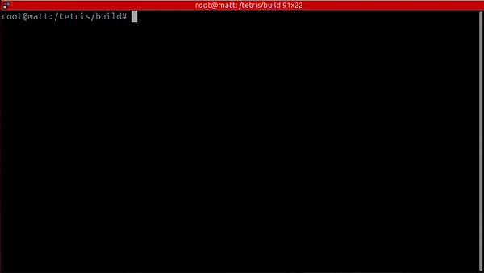

# 🎮 🧱 Tetris in Terminal



## 🐳 Container workflow
```bash
# Build image
docker build .

# Start container
docker compose up -d

# Enter container
docker exec -it tetris-tetris-1 /bin/bash
```

### Build and play
```bash
# Build
mkdir -p build/ && cd build/
cmake ..
make

# Start game
./tetris
```

## 📝 Notes

- The game uses ncurses for cross-platform terminal graphics
- Docker setup includes all necessary dependencies
- Volume mounting allows for live code editing